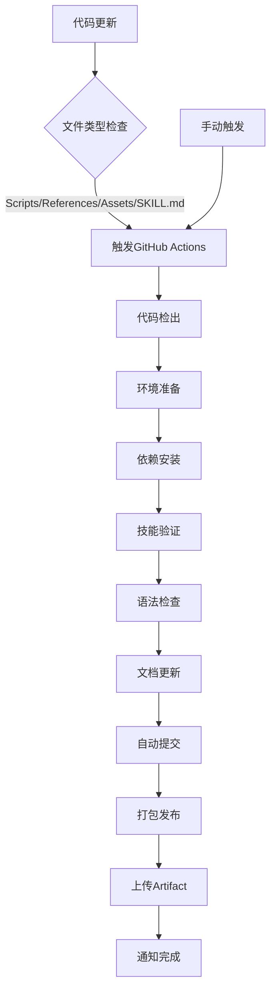

# 自动化推送说明

## 概述

本项目已配置了GitHub Actions自动化工作流，实现skills技能更新后自动推送到GitHub。

## 自动化功能

### 1. 自动推送触发条件

当以下文件发生变化时，会自动触发推送流程：

- `scripts/` 目录下的所有文件
- `references/` 目录下的所有文件
- `assets/` 目录下的所有文件
- `SKILL.md` 文件
- `README.md` 文件

### 2. 自动化工作流

#### 主要工作流：`skills-auto-update.yml`

**触发条件：**
- Push到main/master分支
- Pull Request到main/master分支
- 手动触发

**执行步骤：**
1. **代码检出** - 获取最新代码
2. **环境准备** - 安装Python环境
3. **依赖安装** - 安装必要的Python包
4. **技能验证** - 验证skill结构完整性
5. **语法检查** - 检查Python脚本语法
6. **文档更新** - 自动更新文档
7. **自动提交** - 提交更改并推送到GitHub
8. **打包发布** - 创建skill包文件
9. **artifact上传** - 上传构建产物

#### 辅助工作流：`auto-push.yml`

**功能：**
- 智能提交检测
- 版本号自动更新
- 自动发布release

### 3. 自动化流程图



## 使用方法

### 方法1：本地开发后推送

1. **修改skill文件**
   ```bash
   # 编辑任意skill文件
   vim scripts/new_feature.py
   vim references/new_reference.md
   ```

2. **提交并推送**
   ```bash
   git add .
   git commit -m "feat: Add new feature"
   git push
   ```

3. **查看自动化结果**
   - 访问GitHub仓库页面
   - 点击"Actions"标签
   - 查看workflow运行状态

### 方法2：GitHub网页编辑

1. **在线编辑文件**
   - 在GitHub网页中编辑文件
   - 点击"Commit changes"

2. **自动化处理**
   - GitHub Actions自动检测到更改
   - 触发自动化工作流
   - 自动更新文档和版本

### 方法3：Pull Request

1. **创建新分支**
   ```bash
   git checkout -b feature/new-improvement
   ```

2. **提交更改**
   ```bash
   git add .
   git commit -m "feat: Add new improvement"
   git push origin feature/new-improvement
   ```

3. **创建Pull Request**
   - 在GitHub网页创建PR
   - 合并PR时触发自动化流程

## 自动化特性

### 1. 智能验证

- ✅ 验证SKILL.md结构
- ✅ 检查name和description字段
- ✅ 验证必需目录存在
- ✅ Python脚本语法检查

### 2. 自动打包

- ✅ 创建.zip格式skill包
- ✅ 排除不必要的文件
- ✅ 上传到GitHub Artifact
- ✅ 保留30天

### 3. 文档更新

- ✅ 自动更新最后更新时间
- ✅ 维护版本信息
- ✅ 生成变更日志

### 4. 通知机制

- ✅ GitHub Actions页面显示进度
- ✅ 邮件通知（可选）
- ✅ 成功/失败状态记录

## 配置说明

### 1. GitHub Secrets

**无需配置** - GitHub Actions自动使用内置的`GITHUB_TOKEN`

### 2. 权限设置

确保以下权限已启用：
- ✅ Settings → Actions → General → Workflow permissions
- ✅ "Read and write permissions"
- ✅ "Allow GitHub Actions to create and approve pull requests"

### 3. 分支保护

建议启用分支保护规则：
- ✅ Require status checks to pass
- ✅ Require branches to be up to date
- ✅ Include administrators

## 监控和维护

### 1. 查看工作流状态

访问：`https://github.com/yhai3596/quality-assisant/actions`

### 2. 工作流日志

每个workflow运行都有详细日志：
- 安装步骤
- 验证结果
- 错误信息
- 性能数据

### 3. 失败排查

常见失败原因：
1. **语法错误** - Python脚本语法问题
2. **文件缺失** - 必需文件不存在
3. **权限问题** - GitHub Actions权限不足
4. **网络问题** - 依赖下载失败

## 高级配置

### 1. 自定义触发条件

修改`.github/workflows/skills-auto-update.yml`：

```yaml
on:
  push:
    branches: [ main, develop ]
    paths:
      - 'scripts/**'
      - 'references/**'
      - 'assets/**'
      - 'SKILL.md'
  schedule:
    - cron: '0 2 * * *'  # 每日凌晨2点
```

### 2. 添加通知

```yaml
- name: Send notification
  uses: 8398a7/action-slack@v3
  with:
    status: ${{ job.status }}
    channel: '#skills-updates'
  if: always()
```

### 3. 自定义脚本

在workflow中添加自定义脚本：

```yaml
- name: Custom validation
  run: |
    echo "Running custom validation..."
    python scripts/custom_validator.py
    ./scripts/run_tests.sh
```

## 最佳实践

### 1. 提交规范

使用语义化提交信息：
```
feat: Add new analysis tool
fix: Resolve validation error
docs: Update documentation
refactor: Improve code structure
test: Add unit tests
```

### 2. 分支策略

- `main` - 生产就绪代码
- `develop` - 开发中代码
- `feature/*` - 新功能分支
- `hotfix/*` - 紧急修复分支

### 3. 代码审查

- 所有更改通过Pull Request
- 至少一个审查者
- 通过所有自动化检查

### 4. 版本管理

- 使用语义化版本号
- 自动生成变更日志
- 创建GitHub Release

## 故障排除

### 问题1：Workflow未触发

**检查：**
- 文件路径是否在触发条件中
- 分支名称是否正确
- GitHub Actions是否启用

### 问题2：验证失败

**解决：**
- 检查SKILL.md格式
- 验证必需字段
- 确认目录结构

### 问题3：权限拒绝

**解决：**
- 检查仓库设置
- 确认workflow权限
- 联系仓库管理员

## 联系信息

如需技术支持，请：
- 查看GitHub Issues
- 查看Actions日志
- 联系开发团队

---

**最后更新：** 2025-01-21
**文档版本：** v1.0.0
